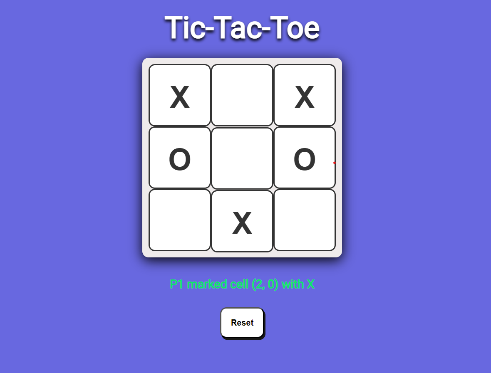

# Tic-Tac-Toe

A classic Tic-Tac-Toe game built using HTML, CSS, and JavaScript (ES6 modules).

Project Link: [https://github.com/RushilJalal/tic-tac-toe](https://github.com/RushilJalal/tic-tac-toe)



## Features

- Simple and intuitive UI
- Responsive design
- Two-player mode
- Game state tracking
- Replay functionality

## Getting Started

### Prerequisites

- [Node.js](https://nodejs.org/)

### Installation

1. Clone the repository:
    ```sh
    git clone https://github.com/RushilJalal/tic-tac-toe.git
    ```
2. Navigate to the project directory:
    ```sh
    cd tic-tac-toe
    ```
3. Install the dependencies:
    ```sh
    npm install
    ```
4. Run the application locally:
    ```sh
    npm run dev
    ```

## Usage

- Open your browser and navigate to `http://localhost:3000`
- Enjoy playing Tic-Tac-Toe!

## Project Structure

- `public/` - Contains static assets and the main HTML file
- `src/` - Contains JavaScript modules and CSS files

## Contributing

1. Fork the repository
2. Create a new feature branch:
    ```sh
    git checkout -b feature/YourFeature
    ```
3. Commit your changes:
    ```sh
    git commit -m 'Add new feature'
    ```
4. Push to the branch:
    ```sh
    git push origin feature/YourFeature
    ```
5. Open a pull request

